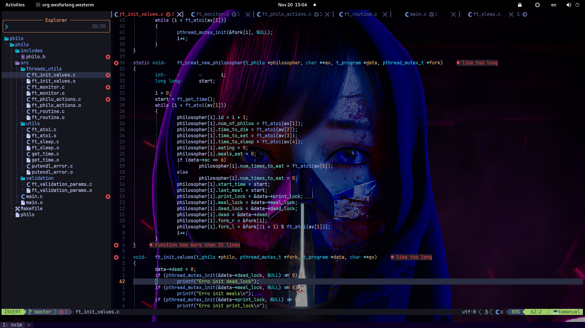

# Configurações Pessoais de WezTerm, Vim e Neovim

Este repositório contém minhas configurações pessoais para ferramentas de desenvolvimento, incluindo:

- **WezTerm**: terminal moderno e altamente configurável.
- **Vim**: editor de texto clássico.
- **Neovim (nvim)**: versão moderna do Vim com suporte a plugins e Lua.

---


## Estrutura do Repositório

```plaintext
.
├── wezterm/        # Configurações do WezTerm
│   └── wezterm.lua
├── vim/            # Configurações do Vim
│   └── vimrc
├── nvim/           # Configurações do Neovim
│   ├── init.vim
│   └── lua/        # Configurações em Lua para Neovim (ex: LazyVim, plugins)
└── README.md

